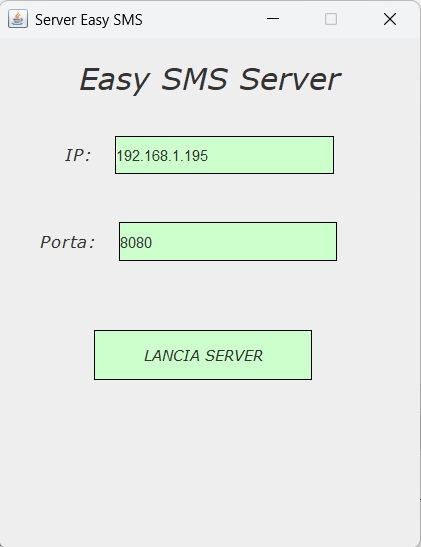
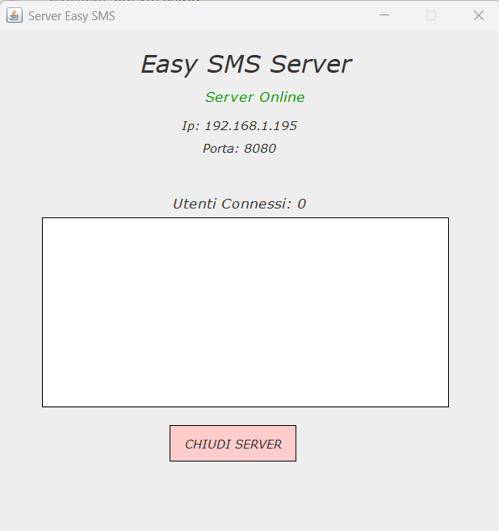
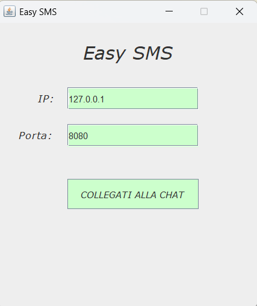
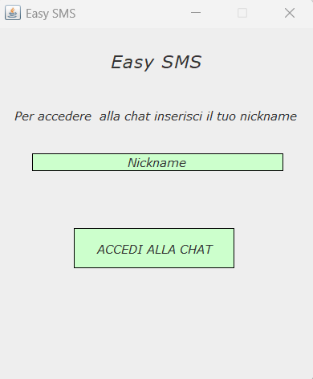
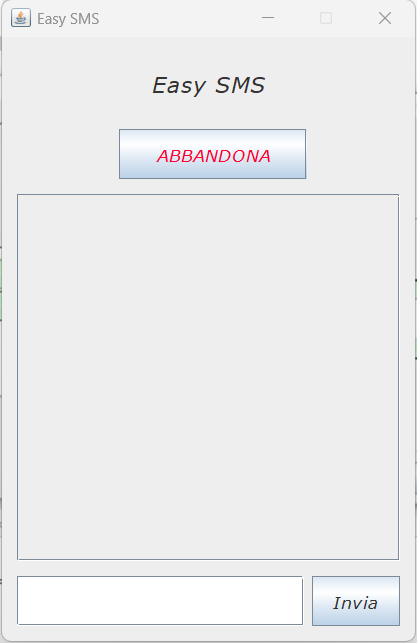
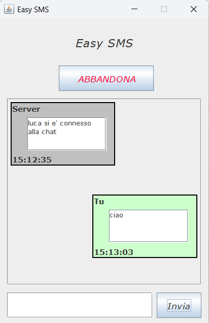
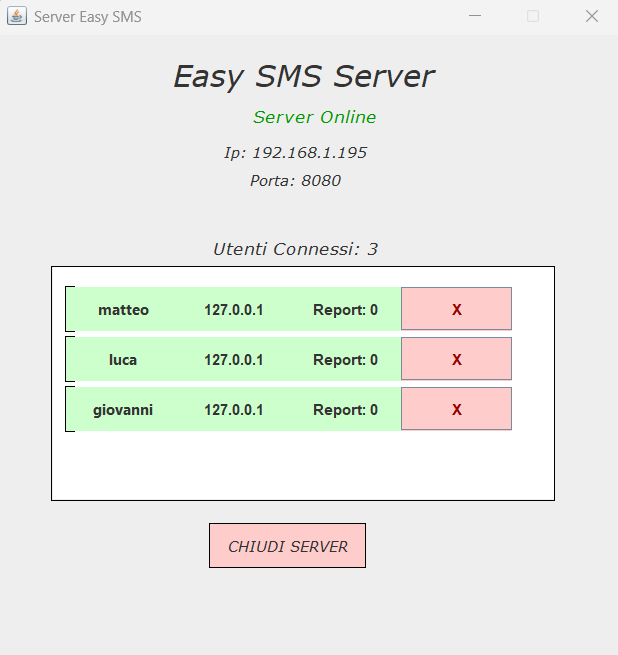
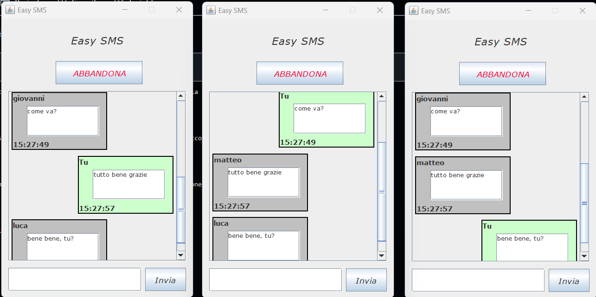

# Progetto TPSIT Laboratorio
## Progettazione di una chat con architettura client-server 
### Realizzato da Luca Carbone, Matteo Medola e Giovanni Giove classe 5E, Anno Scolastico 2024/25

_CLIENT + SERVER_: **Luca Carbone** [@Luca Carbone](https://github.com/lucarbone)

_SERVER CODE+GUI_: **Giovanni Giove** [@Giovanni Giove](https://github.com/giove06)

_CLIENT CODE+GUI_: **Matteo Medola** [@Matteo Medola](https://github.com/MatteoMedola)

# 1.Introduzione
Per questo progetto presentiamo la realizzazione e l'implementzione di una chat, sviluppata con architettura _client-server_ .

## Obiettivi minimi da raggiungere
La chat deve funzionare su una rete locale (LAN).

Il server deve accettare la connessione da diversi client identificati da un username univoco,
e verificare che provengano da identità differenti (non a livello ip, ma a livello username).

Ogni client dovrà leggere e scrivere messaggi simultaneamente. 

Ogni messaggio deve essere preceduto dall'username di colui che l'ha inviato, in modo che ciascun client sappia chi ha scritto il messaggio e l'ora in cui è stato scritto.

Il server deve provvedere a un sistema di logging degli eventi principali.
#
Nella realizzazione del progetto, ci siamo concentrati subito sul realizzare gli obiettivi minimi creando appunto due repository differenti: una client e una server, così da porre le basi per l'architettura client-server.

Dopo aver creato le cartelle, abbiamo creato l'interfaccia grafica di base sia del server che del client, integrando poi all'interfaccia le funzionalità di base richieste dalla consegna.

## Ambiente di sviluppo utilizzato
Abbiamo deciso di utilizzare come ambiente di sviluppo: _NetBeans_, perché ci ha permesso di realizzare l'interfaccia grafica della nostra chat, in maniera semplice e veloce.
Permettendoci poi di modificarla e aggiornarla in maniera rapida avanzando nella fase di realizzazione del progetto.

## Funzionalità aggiuntive 
Una volta terminata l'implementazione degli obiettivi minimi, ci siamo concentrati sulla realizzazione di nuove funzionalità che permettessero alla chat di essere più completa.

* Utilizzo dell'interfaccia grafica java Swing: ci ha permesso di dare una forma reale alla nostra chat, permettendoci di renderla interattiva per l'utente.

### Funzionalità del Server

* Il server è parte della chat: infatti il server tramite la scrittura di determinati messaggi da parte del client fornirà delle risposte, ogni qualvolta un client abbandona la chat,
  o viene bannato il server lo farà presente a tutti gli altri client connessi ad esso. Il server risponde a determinati messaggi scritti dagli utenti, e sono:
    * Comando "Data": il server risponde all'utente che ha inviato questo messaggio con la data e l'ora aggiornata al momento dell'invio del messaggio
    * Comando "Utenti": il server invia come risposta all'utente la lista degli utenti presenti in quel momento all'interno della chat
    * Comando "Help": il server invia come risposta all'utente, i comandi che lui stesso può svolgere.
    * Comando "Report": il server, se un utente segnala un altro utente, può bannare l'utente segnalato, e di conseguenza restituirà un messaggio in cui dice che l'utente in questione è stato bannato

* Ban degli utenti: nell'interfaccia del server quando viene mostrato l'utente che si è connesso, viene mostrato affianco, un bottone rosso che permette di bannare un client dalla chat e quindi dal server.

### Funzionalità del Client

* Gestione del nickname: questa gestione controlla che l'utente inserisca effettivamente un nickname e se esso è già in utilizzo, chiede all'utente di inserirne uno nuovo.
* Bottone di abbandono della chat: funzionalità che permette ad ogni client di abbandonare la chat, in qualsiasi momento.
* Sistema di report degli utenti: un'utente nella chat può segnalare al server il comportamento scorretto di un altro utente così che esso possa bannarlo dalla chat, questo avviene scrivendo nella barra dei messaggi:
  report + nome dell'utente da reportare.
* Gestione dell'interfaccia dei messaggi: il client permette di gestire l'interfaccia con cui compaiono i messaggi all'interno della chat, gestendone colore, testo e orario.

# 2.Presentazione del funzionamento dell'applicazione
Per avviare l'applicazione per prima cosa si deve avviare il server, che una volta avviato mostrerà la seguente interfaccia:

Successivamente cliccando sul bottone per creare il server, si aprirà un'altra finestra che consentirà di vedere lo stato del server:

Una volta fatto questo ci spostiamo dal server e avviamo il client, che una volta avviato, mostrerà la seguente interfaccia:

Cliccando sul bottone per collegarsi alla chat, si apre una nuova finestra in cui viene richiesto di inserire il proprio nickname, per poter accedere alla chat: 

Una volta messo il nickname in maniera corretta, si clicca sul tasto di accesso alla chat e si entra nella finestra in cui si possono inviare i messaggi:

Successivamente l'utente può iniziare ad inviare messaggi, o aspettare che altri client si colleghino, eccone un esempio:

Ora che ci sono connessi più utenti al server torniamo sullo stato del server come è cambiata la situazione:

Vediamo un esempio di comunicazione nella chat tra più utenti

# 3.Conclusioni

La realizzazione di questo progetto, è andata con successo, le difficoltà incontrate nell'implementazione e nella creazione della chat sono state risolte, lo sviluppo sia del codice che del dell'interfaccia è avvenuto
gradualmente, partendo da una base semplice per arrivare poi al progetto terminato.
Questo progetto è stato utile per capire com'è lavorare in gruppo e come funzioni la suddivisione del lavoro al suo interno.
È stato molto utile anche per aumentare le conoscenze e le competenze.

