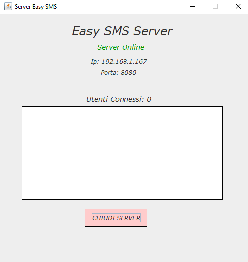
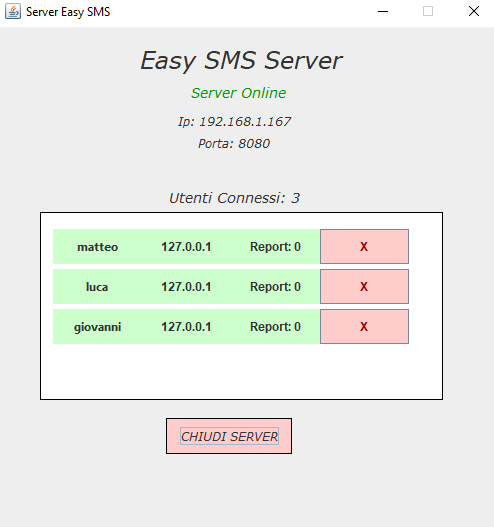

# Progetto TPSIT Laboratorio
## Progettazione di una chat con architettura client-server 
### Realizzato da Luca Carbone, Matteo Medola e Giovanni Giove classe 5E, Anno Scolastico 2024/25

_CLIENT + SERVER_: **Luca Carbone** [@Luca Carbone](https://github.com/lucarbone)

_SERVER CODE+GUI_: **Giovanni Giove** [@Giovanni Giove](https://github.com/giove06)

_CLIENT CODE+GUI_: **Matteo Medola** [@Matteo Medola](https://github.com/MatteoMedola)

# 1.Introduzione
In questo progetto ci è stata richiesta dall'insegnate la realizzazione di una chat client-server in Java sfruttando il lavoro svolto precedentemente in classe. Siamo stati suddivisi in più gruppi e ci sono state date le direttive per sviluppare il tutto.

## Ambiente di sviluppo utilizzato
Abbiamo deciso di utilizzare come ambiente di sviluppo: _NetBeans_, perché ci ha permesso di realizzare l'interfaccia grafica della nostra chat, in maniera semplice e veloce.
Permettendoci poi di modificarla e aggiornarla in maniera rapida avanzando nella fase di realizzazione del progetto.

## Obiettivi minimi
* La chat deve funzionare su una rete locale (LAN).

* Il server deve accettare la connessione da diversi client identificati da un username univoco,
e verificare che provengano da identità differenti (non a livello ip, ma a livello username).

* Ogni client dovrà leggere e scrivere messaggi simultaneamente. 

* Ogni messaggio deve essere preceduto dall'username di colui che l'ha inviato, in modo che ciascun client sappia chi ha scritto il messaggio e l'ora in cui è stato scritto.

* Il server deve provvedere a un sistema di logging degli eventi principali.
#

Nella realizzazione del progetto, ci siamo concentrati subito sul realizzare gli obiettivi minimi creando appunto due cartelle differenti: una client e una server, così da porre le basi per l'architettura client-server.
Dopo aver creato le cartelle, abbiamo progettato l'interfaccia grafica di base sia del server che del client, integrando poi le funzionalità di base richieste dalla consegna.

## Funzionalità aggiuntive 
Una volta terminata l'implementazione degli obiettivi minimi, ci siamo concentrati sulla realizzazione di nuove funzionalità che permettessero alla chat di essere più completa e funzionale. inizialmente abbiamo seguito i punti suggeriteci dal professore per poi mettere insieme qualche idea personale per rendere l'applicazione più interessante e presonalizzata.

# 2.Primi schizzi per la progettazzione dell'interfaccia grafica
  
  

# 3.Caratteristiche dell'applicazione
### Funzionalità del Server

* Il server è parte della chat: infatti il server tramite la scrittura di determinati messaggi da parte del client fornirà delle risposte, ogni qualvolta un client entra/abbandona la chat,
  o viene bannato il server lo farà presente a tutti gli altri client connessi ad esso. Il server risponde a determinati messaggi scritti dagli utenti, e sono:
    * Comando "Help": il server invia come risposta all'utente, i comandi che lui stesso può svolgere.
    * Comando "Data": il server risponde all'utente che ha inviato questo messaggio con la data e l'ora aggiornata al momento dell'invio del messaggio.
    * Comando "Utenti": il server invia come risposta all'utente la lista degli utenti commessi in quel momento all'interno della chat.
    * Comando "Report" seguito da uno spazio e dall'username dell'utente che si desidera segnalare: permette di segnalare solamente una volta uno specifico utente in modo che l'amministratore del server venga allertato di eventuali comportamenti scorretti all'interno della chat e possa provvedere bannando gli utenti. 

* Ban degli utenti: nell'interfaccia del server quando viene mostrato l'utente che si è connesso, viene mostrato affianco, un bottone rosso che permette di bannare un client dalla chat e quindi dal server.
* Controllo inserimento porta (se è utilizzata da un'altro processo viene visualizzato un messaggio).
* Gestione completa degli errori che possono occorrere.
* Controllo e avviso ai client della chiusura del server.
### Funzionalità del Client

* Gestione del nickname: questa gestione controlla che l'utente inserisca effettivamente un nickname e se esso è già in utilizzo, chiede all'utente di sceglierne uno differente.
* Bottone di abbandono della chat: funzionalità che permette ad ogni client di abbandonare la chat, in qualsiasi momento.
* Richiedere servizi al server: tramite alcuni comandi specifici (descritti prima) il singolo utente può far svolgere al server determinati compiti. 

# 4.Presentazione del funzionamento dell'applicazione
Per avviare l'applicazione per prima cosa si deve avviare il server, che una volta avviato mostrerà la seguente interfaccia:

Successivamente cliccando sul bottone per creare il server, si aprirà un'altra finestra che consentirà di vedere lo stato del server:

Una volta fatto questo ci spostiamo dal server e avviamo il client, che una volta avviato, mostrerà la seguente interfaccia:

Cliccando sul bottone per collegarsi alla chat, si apre una nuova finestra in cui viene richiesto di inserire il proprio nickname, per poter accedere alla chat: 

Una volta messo il nickname in maniera corretta, si clicca sul tasto di accesso alla chat e si entra nella finestra in cui si possono inviare i messaggi:

Successivamente l'utente può iniziare ad inviare messaggi, o aspettare che altri client si colleghino, eccone un esempio:

Ora che ci sono connessi più utenti al server torniamo sullo stato del server come è cambiata la situazione:

Vediamo un esempio di comunicazione nella chat tra più utenti

# 5.Conclusioni

Questo progetto si è concluso con successo, le difficoltà incontrate nell'implementazione e nella creazione della chat sono state risolte con più o meno difficoltà. Lo sviluppo sia del codice che dell'interfaccia è avvenuto
gradualmente, partendo da un'idea trasformata in un semplice schizzo per passare successivamente ad una beta dell'applicazione per arrivare poi al progetto terminato.
Esprimendo il nostro punto di vista questo progetto ci ha permesso di crescere molto sia presonalmente che come gruppo. Abbiamo imparato a relazionarci in modo efficace, a risolvere problemi lavorando come un team arricchendoci a vicenda e migliorando notevolmente le nostre capacità di programmazione. Le insicurezze e dubbi che avevamo all'inizio sono completamente svaniti e grazie all'esperienza (anche se misera) che ci ha fornito questo compito siamo già pronti ad affrontare lavori simili a testa alta.

Luca Carbone, Giovanni Giove, Matteo Medola
5 gennaio 2025.

